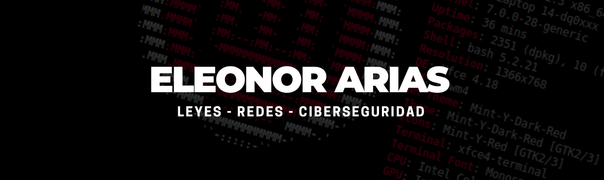

**Construyendo puentes entre el Derecho y la Tecnología** | Protegiendo datos con redes seguras, políticas claras y herramientas propias.

Soy abogada de formación y apasionada por la ciberseguridad. Mi enfoque combina el conocimiento legal con habilidades técnicas avanzadas para desarrollar soluciones de seguridad ofensiva y defensiva. Me especializo en el análisis de redes IP y la creación de herramientas de pentesting que ayudan a fortalecer infraestructuras críticas.

  
### Habilidades Técnicas y Profesionales

| Área | Habilidades Clave |
| :--- | :--- |
| **Ciberseguridad Ofensiva** | Pentesting inalámbrico (WPA2), Análisis de Handshakes, Ataques de Diccionario con `Aircrack-ng`, Auditoría de Seguridad en Capa Física. |
| **Redes e Infraestructura IP** | Diseño y Segmentación de Redes (VLANs), Configuración de Firewalls y ACLs, Protocolos (TCP/IP, DNS, VPN), Routing y Switching, Cisco Packet Tracer. |
| **Desarrollo de Herramientas** | Programación en **Python** para ciberseguridad, Desarrollo de aplicaciones con interfaz gráfica GUI/CLI, Automatización de tareas de seguridad. |
| **Ciencia de Datos** | **Business Intelligence (Power BI)**: Creación de dashboards interactivos y análisis de datos para la toma de decisiones estratégicas. (Diplomado - Edutin) |
| **Sistemas Operativos** | Administración y hardening de sistemas **Linux** y **Windows**. Configuración de entornos para pruebas de seguridad. |
| **Competencias Legales** | Asesoría en cumplimiento normativo, protección de datos, análisis de riesgos legales en entornos tecnológicos. |

---

  
## 🛠️ Mis Proyectos

🔐 **Proyecto 1: Segmentación de Red PYME con VLANs y Firewall**  
*Cisco Packet Tracer | ACLs | Seguridad perimetral*

Diseño e implementación de una red empresarial segmentada lógicamente para una PYME con los departamentos de RRHH, Auditoría, Legal y Dirección.

- ✅ Configuración de VLANs por departamento con aislamiento total de tráfico entre ellos.
- ✅ Implementación de ACLs en firewall para control de acceso granular.
- ✅ Acceso irrestricto solo para el departamento de Dirección a todas las VLANs.
- ✅ Servidores (MAIL, BACKUP, FILES) en VLAN separada con acceso desde todos los departamentos.
- ✅ Objetivo: garantizar confidencialidad, aislamiento de fallos y control centralizado.

**Tecnologías:** `Cisco Packet Tracer` `VLANs` `ACLs` `IPv4` `Firewall`

**Descripción rápida:** Implementación de una red PYME con departamentos (RRHH, Auditoría, Legal, Dirección) aislados mediante VLANs y políticas de acceso con firewall, garantizando confidencialidad y control centralizado.

---

📡 **Proyecto 2: WiFi Handshake Auditor**  
*Pentesting inalámbrico | RTL88x2bu | Aircrack-ng*

Herramienta de seguridad ofensiva para auditoría de redes WPA2, enfocada en evaluar la robustez de contraseñas en entornos WiFi.

- ✅ Configuración de adaptador WiFi (RTL88x2bu) en modo monitor sobre Linux.
- ✅ Captura y análisis de handshakes WPA2, incluyendo redes con SSID oculto.
- ✅ Ataques de diccionario con aircrack-ng para validación de fortaleza de claves.
- ✅ Enfoque en hardening de redes inalámbricas y evaluación de riesgos en capa física.

**Tecnologías:** `Linux` `Aircrack-ng` `RTL88x2bu` `Wireshark` `Modo Monitor`

**Descripción rápida:** Proyecto de seguridad ofensiva que documenta la configuración de hardware, captura de handshakes WPA2 (incluso con SSID oculto) y ataques de diccionario para evaluar la robustez de contraseñas en redes inalámbricas.

---

🔑 **Proyecto 3: Generador y Analizador de Contraseñas Seguras (pypher-password)**
*Python | Tkinter | Ciberseguridad*

Aplicación de escritorio para generar y analizar contraseñas robustas y aleatorias, diseñada para ayudar a crear credenciales seguras que cumplan con políticas de complejidad.

- ✅ **Interfaz gráfica (GUI):** Desarrollada con Tkinter para ser fácil de usar.
- ✅ **Personalización de la contraseña:** Permite al usuario seleccionar la longitud y los tipos de caracteres a incluir (mayúsculas, minúsculas, números, símbolos).
- ✅ **Cálculo de entropía:** Muestra la fortaleza de la contraseña generada en tiempo real.
- ✅ **Copiado al portapapeles:** Función para copiar la contraseña de forma segura y usarla inmediatamente.

**Tecnologías:** `Python` `Tkinter` `Seguridad Informática` `Desarrollo de Herramientas`

**Descripción rápida:** Generador de contraseñas con interfaz gráfica que permite personalizar la complejidad y visualizar la fortaleza de la clave, facilitando la creación de credenciales seguras.

---

## 
📚 Formacion Academica y Certificaciones

| Area | Formacion |
|------|-----------|
| **Informatica** | Tecnico en Informatica y Seguridad Host (Linux, Windows) |
| **Redes IP** | Tecnico en Redes IP - Protocolos, VLAN, Router, Firewall, Antivirus, DNS, VPN |
| **Inteligencia Artificial** | Programa en IA Generativa - UNMSM | IA Generativa - Microsoft |
| **Negocios** | Programa en Negocios de Harvard Business School Online | Beca Santander |
| **Derecho** | Licenciatura en Derecho |
| **Sistemas** | Linux & Ciberseguridad |

